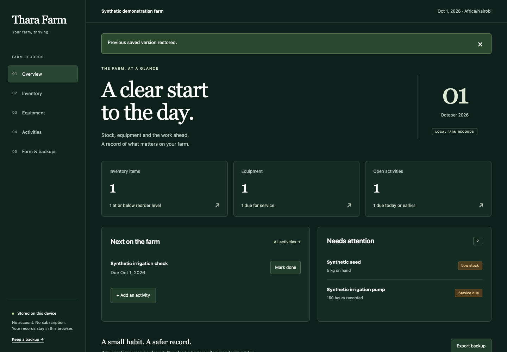
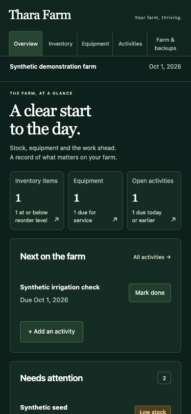

# Thara Farm — local edition

A free, local farm notebook for inventory, equipment maintenance and daily work. Records stay in this browser; no account, subscriptions, analytics, hosted AI or cloud backend are required.

This initial local edition is licensed under Apache-2.0. Copyright 2026 Ni Biashara LLC. See LICENSE and NOTICE. Publication and safe legacy cutover are separate steps.

## Run locally

Requires Node.js 22 or newer and npm. Install dependencies with `npm ci`, then run `npm run dev`. For a production build use `npm run build`, then `npm run preview`. Open the local address printed by Vite. Dependency installation requires internet the first time; the running app does not require a hosted service.

Serve `dist/` at the root of a static HTTPS origin (or localhost). Do not open index.html with a file:// URL. The service worker caches the complete production app after a successful online load; it is not registered as a working offline shell during development. Keep the page open until offline setup completes before disconnecting. Browser or OS clearing, eviction and device loss can still remove records and cached files.

## Daily use

Start with an empty farm. Choose farm name, currency and IANA time zone in Settings. Inventory units are explicit per item: kilograms and bags are different units; there is no hidden conversion. Receive opening stock, then record each receipt, use or signed adjustment. Adjustments require a reason; historical movements cannot be silently edited.

Equipment tracks accumulated hours or kilometres, service intervals by meter and/or calendar, and service history. A missing schedule is not evidence that equipment is safe or maintained. The farmer chooses intervals from their own equipment guidance. Activities record work dates and due dates; there is no agricultural diagnosis, automatic treatment advice or fabricated production forecast.

## Data and recovery

Read [LOCAL-DATA.md](LOCAL-DATA.md). Export a JSON backup after important work and keep a copy on another device or drive. A same-browser previous version is a convenience, not disaster recovery. Data is not encrypted; protect device access and exported files.

The old private application and records remain preserved. This edition does not silently import earlier `thara_` records or cloud events. Legacy export is a preservation file, not a directly importable version-1 operations backup. Existing livestock, produce and milk histories need a separately tested mapping before migration. New livestock/crop-specialist workflows, financial accounting, multiuser collaboration and model features are outside this release.

## Development and contributions

Run the operations regression suite with `node --experimental-strip-types tests/operations.test.mjs`. Validate TypeScript with `npx tsc -p tsconfig.app.json --noEmit --incremental false`, then build. Use only synthetic test data. See [CONTRIBUTING.md](CONTRIBUTING.md) and [SECURITY.md](SECURITY.md).

## Preview

Screenshots show explicitly synthetic records, not a real farm.

